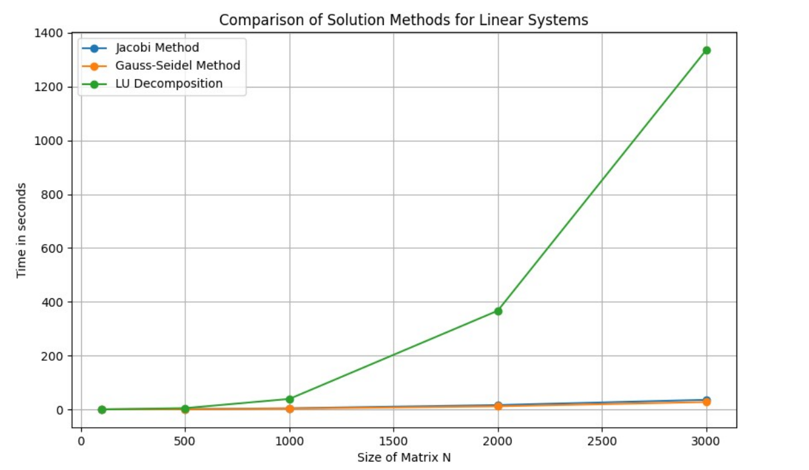

# Linear-System-Solvers

    

## Description
This project focuses on the implementation and analysis of two iterative methods—Jacobi and Gauss-Seidel—and one direct method, LU decomposition, for solving systems of linear equations. The project is implemented in Python and includes the use of numerical and scientific libraries such as Matplotlib for data visualization and `math` and `time` modules for mathematical computations and performance measurement.

A more detailed report is available in the file **`sprawozdanie.pdf`**.

## Files
- `ZADANIE_A.py`: Constructs a band matrix and vector, providing the basis for analyzing linear equation systems.
- `ZADANIE_B.py`: Implements and tests the Jacobi and Gauss-Seidel iterative methods.
- `ZADANIE_C.py`: Tests the iterative methods with different matrix values to observe convergence behavior.
- `ZADANIE_D.py`: Applies LU decomposition to solve the system of equations and compares it with iterative methods.
- `ZADANIE_E.py`: Compares the performance of Jacobi, Gauss-Seidel, and LU decomposition methods for different matrix sizes.

# Methods and Functions
## General Functions
- `decompose_lu(matrix)`: Decomposes a matrix into lower and upper triangular matrices (LU decomposition).
- `solve_lower_triangular(triangular_matrix, vector)`: Solves a system of linear equations with a lower triangular matrix.
- `solve_upper_triangular(triangular_matrix, vector)`: Solves a system of linear equations with an upper triangular matrix.
- `compute_residual_norm(system_matrix, solution_vector, right_side_vector)`: Computes the norm of the residuals for a system of equations.
- `measure_performance(solver, system_matrix, vector_b)`: Measures the performance of a solver method.

## Iterative Methods
- `solve_jacobi(system_matrix, vector_b, error_tolerance=1e-9, max_loop=10000)`: Solves a system of linear equations using the Jacobi iterative method.
- `perform_gauss_seidel(matrix, target_vector, precision_threshold=1e-9, max_loops=10000)`: Solves a system of linear equations using the Gauss-Seidel iterative method.

## Analysis Methods
- `calculate_row_value(matrix, current_estimate, target_vector, row_index)`: Calculates the value for a specific row in an iterative method.
- `compute_residuals(matrix, next_solution, target_vector)`: Computes the residuals for a system of equations.
- `calculate_residual_norm(matrix, current_estimate, target_vector)`: Calculates the norm of the residuals for a current estimate.
- `perform_method(method, A, b, max_iterations=10000)`: General function to perform a given iterative method and compute residual norms.

# Results Summary
## General Analysis
- **Residual Norms**: Residual norms are used to assess the accuracy and convergence of the solutions.
- **Jacobi Method**: Demonstrated slower convergence compared to the Gauss-Seidel method, requiring more iterations to reach the desired precision.
- **Gauss-Seidel Method**: Showed faster convergence, achieving the required accuracy in fewer iterations compared to Jacobi.

## Performance Analysis
- **Iterative Methods**: Both Jacobi and Gauss-Seidel methods maintained relatively stable execution times across different matrix sizes, indicating good efficiency for smaller matrices.
- **LU Decomposition**: The time required for LU decomposition increased significantly with larger matrix sizes, consistent with its computational complexity of O(N^3).

## Observations from Graphs
- **Convergence**: The Gauss-Seidel method converged faster than the Jacobi method, as indicated by the steeper decline in the residual norm on the logarithmic scale.
- **Execution Time**: The Gauss-Seidel method outperformed the Jacobi method in terms of execution time, further highlighting its efficiency.

## Conclusion
- **Iterative Methods**: Suitable for matrices with appropriate properties, particularly diagonal dominance. Their effectiveness varies based on the matrix characteristics.
- **LU Decomposition**: Provides reliable and accurate solutions for complex systems of equations but involves higher computational costs, especially for large matrices.
- **Method Selection**: Choosing the right method depends on the problem size and matrix properties, crucial for achieving computational efficiency and accuracy.

For more detailed analysis and results, please refer to the report in `sprawozdanie.pdf`.
